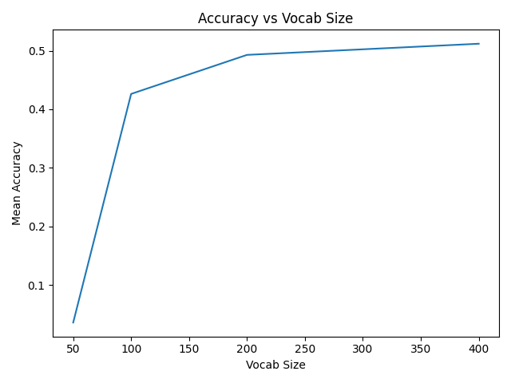

# GNR-638 Assignment 1
Submitted by: **Siddhant Chourasia** and **Prankul Yadav**

---

## Data Preprocessing

There are 21 classes in the UCMerced Land Use dataset. The classes are as follows:
1. agricultural
2. airplane
3. baseballdiamond
4. beach
5. buildings
...

Each class has 100 images. The images are of size 256x256 pixels. The dataset is divided into training and testing sets. The training set has 1680 images and the testing set has 420 images.

The images are stored in the `data` directory. The images are stored in the following directory structure:
```
data
├── test
│   ├── agricultural
│   ├── airplane
│   ├── baseballdiamond
│   ├── beach
│   ├── buildings
|   ...
└── train
    ├── agricultural
    ├── airplane
    ├── baseballdiamond
    ├── beach
    ├── buildings
    ...
```

NOTE: The dataset is available at http://weegee.vision.ucmerced.edu/datasets/landuse.html

## Model Selection

Vocabulary size is a hyperparameter that needs to be tuned. We have tried different vocabulary sizes and the results are as follows:

| Vocabulary Size | Accuracy |
|-----------------|----------|
| 50              | 0.03     |
| 100             | 0.42     |
| 200             | 0.47     |
| 400             | 0.51     |

We have selected the vocabulary size of 400 as it gives the best accuracy.

## Results

Following is the accuracy plot:



Following is the confusion matrix:


Following is the t-SNE plot:

